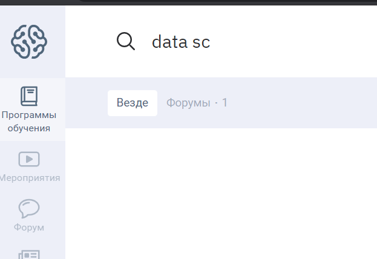

# Юзабилити-тестирование
### Произвела анализ юзабилити сайта, используя сценарный вариант оценки.

**Сайт geekbrains.ru** - образовательная платформа, обучение ведется по дистанционным образовательным программам. Благодаря geekbrains можно выбрать новую специальность, пройти обучение, получить профессиональные навыки, трудоустроиться.

**Основные посетители сайта** – потенциальные слушатели, студенты, а также их родители.
Студенты или слушатели – молодые люди, выбирающие себе будущую профессию, а также зрелые люди, решившие получить новую специальность и трудоустроиться.
Родители школьников, решившие помочь своим детям в выборе профессии, ищущие дополнительные к школьным предметам более углубленные курсы.

**Выбранный сценарий** – Узнать, есть ли курс по Data Science. Если есть, то сколько стоит, сколько длится, какова программа?
**Персонаж** – родитель старшеклассника, который интересуется IT-профессиям.

**Прохождение сценария:**
1. Переход к программам обучения доступен с главной страницы сайта без регистрации на сайте. Ссылка расположена в шапке сайта и хорошо заметна.
1. Поисковая строка открывается при нажатии на значок поиска (лупу).
1. Поиск запускается при введении в поисковую строку ключевых слов. При вводе ответ появляется достаточно быстро. **Поиск автоматически не подсказывает результаты, пока пользователь вводит запрос.**  

1. Результат поиска содержит всю информацию по запросу, доступную на сайте. Просмотреть всю информацию можно не только проскроллив станицу, но и перемещаюсь по вкладкам, расположенным в шапке страницы.
1. По клику на виджет факультета открывается информация о полном курсе обучения, времени обучения, полной программе курсов по четвертям, количестве уроков. Есть возможность получить программу обучения на почту. Проскроллив страницу или переходя по вкладкам можно ознакомиться с преподавательским составом. Клик на кнопку «Хочу учиться» осуществляет переход к информации о стоимости обучения и возможности подать заявку с датой начала занятий. **Доступна информация о стоимости одного месяца обучения, нет информации о полной стоимости обучения. После просмотра курса можно вернуться на страницу всех программ обучения, а не к результатам поиска.**
1. Просмотр дополнительных курсов доступен при клике на название соответствующего курса. Доступна информация о программе курса, формате проведения, длительности и количестве занятий, преподавателе, материалах курса, а также стоимости платных курсов. Возможно ознакомиться с отзывами выпускников, а также записаться на курс, регистрация доступна через электронную почту или соцсети. **После просмотра курса можно вернуться по стрелке на страницу всех программ обучения, а не к результатам поиска.**
1. В разделе вебинаров доступны записи прошедших вебинаров и есть возможность записаться на предстоящие вебинары. Вернуться из раздела вебинаров можно только ко всем мероприятиям курса. **Также нет возможности вернуться к результатам поиска.**
1. Реализована возможность обратиться в поддержку с любой страницы сайта.

### Общий итог: 
Информацию на сайте легко найти, интерфейс портала удобен и понятен пользователю. В результате тестирования не было выявлено основных проблем с интерфейсом. Но можно отметить несколько недоработок, которые вызвали сложности в реализации поставленной задачи:
1. Поиск автоматически не подсказывает результаты, пока пользователь вводит запрос в строку поиска.
2. После просмотра курса можно вернуться по стрелке на страницу всех программ обучения, а не к результатам поиска.

На мой взгляд несколько перегружена страница курса факультета рекламной и другой информацией, часть ее можно перенести или в ссылки, или отдельные вкладки.

